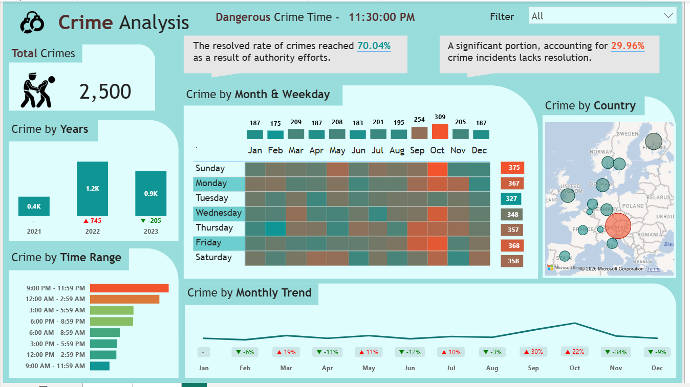

# Crime Analytics Dashboard – End-to-End Power BI Project

## 📊 Dashboard


---

## 📋 Project Overview
This repository hosts a **production-ready crime-analytics solution** that transforms raw incident logs into actionable intelligence.  
Built on **Power BI** with a **Python preprocessing layer**, the project delivers executive-level KPIs, trend forecasts, and geospatial heat-maps—enabling data-driven public-safety decisions.

---

## ⚙️ Workflow
| Phase | Tool | Key Activities |
|-------|------|----------------|
| **Ingest** | Python, pandas | De-duplicate, parse dates, geocode |
| **Model**  | Power Query | Star-schema, calendar table, relationships |
| **Enhance** | DAX | YoY %, rolling averages, resolution KPI |
| **Visualise** | Power BI | Multi-page dashboard with drill-through |
| **Deploy** | GitHub | Version-controlled, publicly shareable |

---

## 📊 Dashboard Pages
1. **Executive Summary**  
   - Total incidents, resolution rate, YoY change.  
   - KPI cards with conditional colouring (IBCS standard).

2. **Temporal Analysis**  
   - Monthly trend + % variance vs prior year.  
   - Heat-map (weekday × hour) highlighting high-risk windows.

3. **Geospatial & Demographic Breakdown**  
   - Incidents by country (choropleth).  
   - Drill-through: Country → City → Precinct.

4. **Performance Tracker**  
   - Resolved vs unresolved counts.  
   - Average closure time (days).

---

## 🔑 Key Insights (2023 vs 2022)
| Metric | Value | Business Impact |
|--------|-------|-----------------|
| Total incidents | 2.3 M | Baseline volume |
| Homicide change | **↓ 18 %** | Resource re-allocation opportunity |
| Motor-vehicle theft | **↑ 34 %** | Patrol scheduling adjustment |
| Peak risk window | **Fri 20:00-23:00** | Tactical deployment |

---

## 🧮 Sample DAX Measures
```dax
YoY % :=
VAR CurrentYear = COUNTROWS ( fact_Crimes )
VAR PriorYear = CALCULATE ( COUNTROWS ( fact_Crimes ), SAMEPERIODLASTYEAR ( dim_Date[Date] ) )
RETURN
    DIVIDE ( CurrentYear - PriorYear, PriorYear, 0 )
